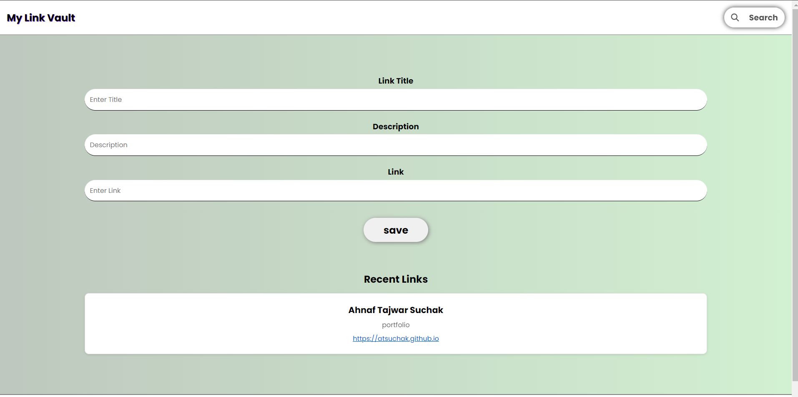

# 🔗 MyLinkVault

A minimalist link-saver web app where users can store and organize important links (like YouTube videos, portfolio pages, or tutorials) along with a custom title and description.

🌐 **Live Demo**: [https://atsuchak.github.io/MyLinkVault](https://atsuchak.github.io/MyLinkVault)



---

## 🚀 Features

- ✏️ Save any link with a **custom title** and **description**.
- 🧠 Stores recent links directly in the browser (no backend needed).
- 🔍 Includes a **search bar** to filter saved links based on keywords.
- 🎨 Clean UI with responsive layout for different devices.
- 🛠 No sign-up or login required — fully browser-based.

---

## 🛠 Tech Stack

- **HTML**
- **CSS**
- **JavaScript**

---

## 📁 Getting Started

No setup needed. To use it locally:

1. **Clone the repository**
   ```bash
   git clone https://github.com/atsuchak/MyLinkVault.git
